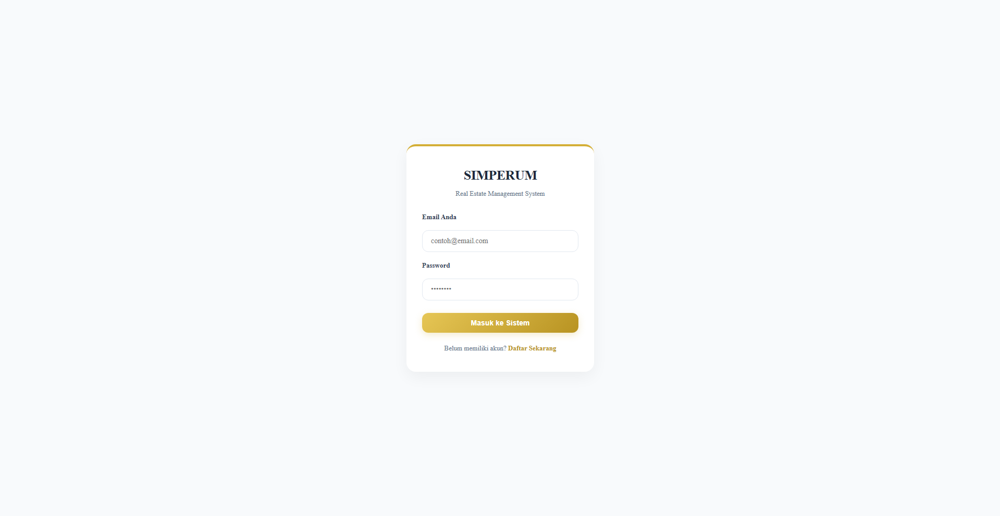
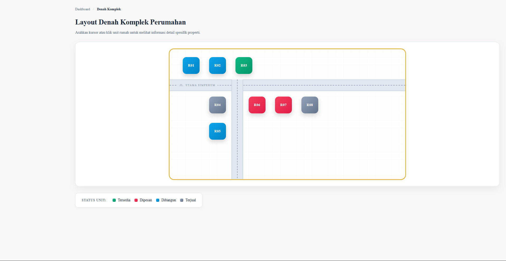
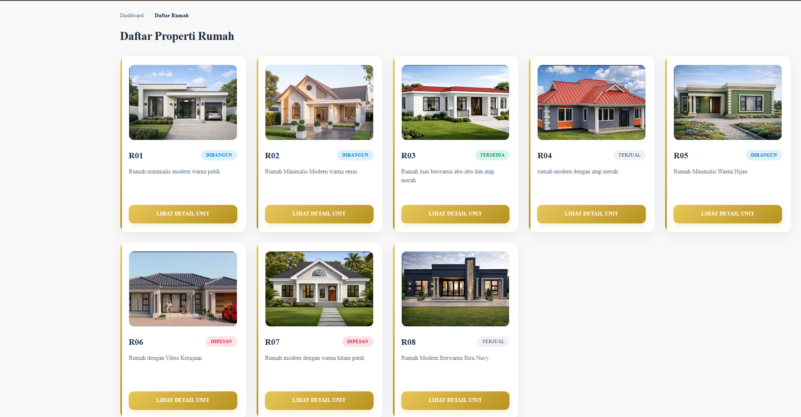
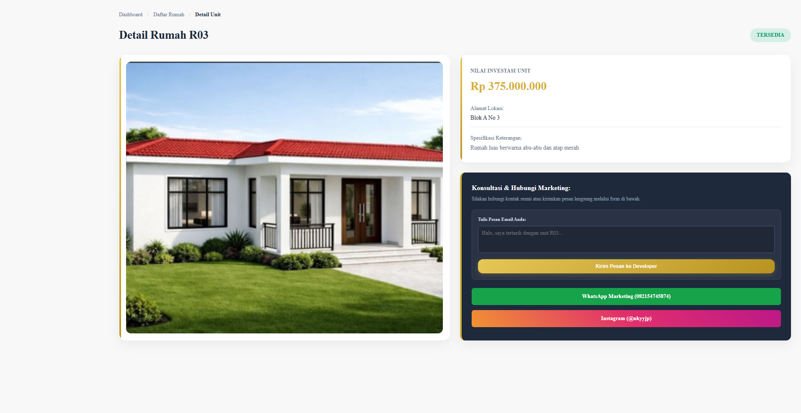
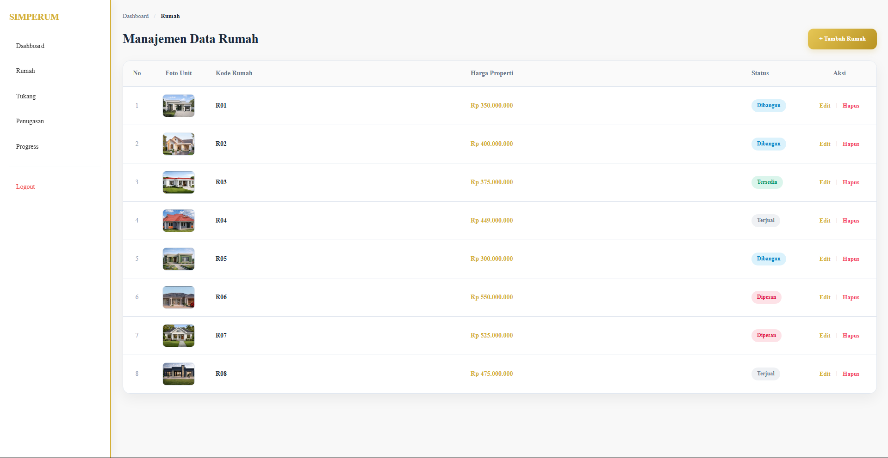

# SIMPERUM - Sistem Informasi & Manajemen Perumahan Berbasis Web

SIMPERUM adalah platform tata kelola properti dan *real estate* berbasis web yang mengintegrasikan digitalisasi peta komplek interaktif, pemantauan rekam jejak progres konstruksi secara riil, serta optimalisasi saluran komunikasi pemasaran unit perumahan. 

Aplikasi ini telah dideploy secara daring dan dapat diakses melalui:
🔗 **[Situs Resmi SIMPERUM](http://simperum.site.je)**

---

## Akun Demo Sistem (Test Credentials)

Gunakan akun uji coba berikut untuk meninjau fungsionalitas penuh sistem berdasarkan masing-masing tingkatan hak akses (*role*):

### 1. Panel Administrator (Admin)
* **Email:** `admin@simperum.com`
* **Password:** `admin123`

### 2. Panel Pengguna (User)
* **Email:** `jp@gmail.com`
* **Password:** `123456`
* *Catatan: Anda juga dapat mendaftarkan akun baru secara mandiri melalui form registrasi.*

---

## Fitur Utama & Dokumentasi Antarmuka

### 1. Gerbang Autentikasi (`index.php`)
Sistem menerapkan pembatasan hak akses (*Role-Based Access Control*) berbasis sesi (`session_start()`). Password akun dilindungi dengan enkripsi bawaan `md5` pada database untuk mencegah kebocoran otorisasi.



### 2. Denah Komplek Interaktif (`user/denah.php`)
Peta visual tata letak perumahan menggunakan pemetaan absolut titik piksel koordinat X dan Y. Blok rumah berubah warna secara dinamis menyesuaikan status riil dari database dan dapat diklik untuk meninjau data properti.
* **Hijau:** Tersedia | **Merah:** Dipesan | **Biru:** Dibangun | **Abu-abu:** Terjual



### 3. Katalog Properti Modern (`user/rumah_user.php`)
Daftar inventaris unit rumah siap huni maupun indent yang disajikan dalam bentuk *card grid* proporsional. Seluruh susunan kartu otomatis menyesuaikan lebar layar perangkat saat diakses lewat handphone.



### 4. Detail Unit & Hubungi Marketing (`user/detail_rumah.php`)
Menampilkan spesifikasi mendalam nilai investasi unit, alamat lokasi, riwayat rekam jejak pembangunan fisik lapangan (log persentase + gambar bukti), serta daftar pekerja konstruksi aktif. Dilengkapi formulir kirim pesan otomatis ke email developer (`naufalrizky.j.p@gmail.com`) serta tombol pintas WhatsApp dan Instagram Marketing.



### 5. Manajemen Data Admin (`admin/rumah.php`)
Panel kendali internal bagi pihak pengembang untuk melakukan operasi manipulasi data (*CRUD*), mengontrol titik koordinat denah, mendaftarkan tenaga ahli (tukang), membagikan penugasan kerja, serta memperbarui persentase progres fisik bangunan beserta unggah foto bukti lapangan.



---

## Petunjuk Operasional Menjalankan Aplikasi Secara Lokal

Ikuti langkah-langkah berikut untuk menjalankan SIMPERUM di lingkungan komputer lokal (*development environment*):

### Prerequisites (Persyaratan Sistem)
* **Web Server lokal:** XAMPP / Laragon / WampServer (Apache & MySQL aktif).
* **Versi PHP:** Minimal PHP 8.2 atau yang lebih baru.

### Langkah Instalasi
1. **Salin Source Code:**
   * Ekstrak atau klon folder proyek ini ke dalam direktori server lokal Anda (misal pada Windows: `C:/xampp/htdocs/simperum/`).
2. **Impor Database MySQL:**
   * Buka browser dan akses halaman `http://localhost/phpmyadmin/`.
   * Buat database baru dengan nama `simperum`.
   * Pilih menu **Import / Impor**, cari berkas basis data `.sql` bawaan proyek ini, kemudian klik **Go / Kirim**.
3. **Konfigurasi Koneksi Database:**
   * Buka berkas `config/koneksi.php` menggunakan teks editor pilihan Anda.
   * Sesuaikan kredensial koneksi server lokal Anda:
     ```php
     <?php
     $host = "localhost";
     $user = "root";
     $pass = "";
     $db   = "simperum";

     $conn = mysqli_connect($host, $user, $pass, $db);

     if (!$conn) {
         die("Koneksi gagal: " . mysqli_connect_error());
     }
     ?>
     ```
4. **Eksekusi Aplikasi:**
   * Buka browser dan ketik alamat URL: `http://localhost/simperum/index.php`.

---

## Struktur Direktori Utama Proyek

```text
📂 simperum/
├── 📂 admin/
│   ├── dashboard.php         # Panel utama kendali data admin
│   ├── rumah.php             # Tabel manajemen properti & kontrol koordinat
│   ├── tambah_rumah.php      # Form input rumah & koordinat piksel denah
│   ├── edit_rumah.php        # Form pembaruan properti & berkas gambar
│   ├── tukang.php            # Tabel data master tenaga ahli konstruksi
│   ├── tambah_tukang.php     # Form registrasi pekerja baru
│   ├── edit_tukang.php       # Form pembaharuan profil tukang
│   ├── penugasan.php         # Manajemen alokasi kerja pekerja lapangan
│   ├── tambah_penugasan.php  # Form penugasan tukang ke unit rumah
│   ├── edit_penugasan.php    # Form update status kerja & tanggal selesai
│   ├── progress.php          # Monitor rekam jejak pembangunan fisik
│   ├── tambah_progress.php   # Form input persentase progres + foto bukti
│   └── edit_progress.php     # Form revisi log pembangunan fisik
├── 📂 user/
│   ├── dashboard.php         # Panel navigasi ringkas pengguna
│   ├── denah.php             # Peta interaktif denah komplek dinamis
│   ├── rumah_user.php        # Katalog daftar rumah komparatif
│   └── detail_rumah.php      # Informasi menyeluruh unit & form kontak
├── 📂 config/
│   └── koneksi.php           # Berkas konfigurasi basis data MySQLi
├── 📂 css/
│   └── style.css             # Lembar gaya arsitektur antarmuka global
├── 📂 uploads/
│   ├── 📂 rumah/             # Penyimpanan berkas foto & denah unit
│   ├── 📂 tukang/            # Penyimpanan foto profil pekerja
│   └── 📂 progress/          # Penyimpanan gambar bukti fisik lapangan
├── login.php                 # Gerbang masuk autentikasi sistem
├── register.php              # Form pendaftaran akun user mandiri
└── logout.php                # Pemutus sesi session & pembersih session login
